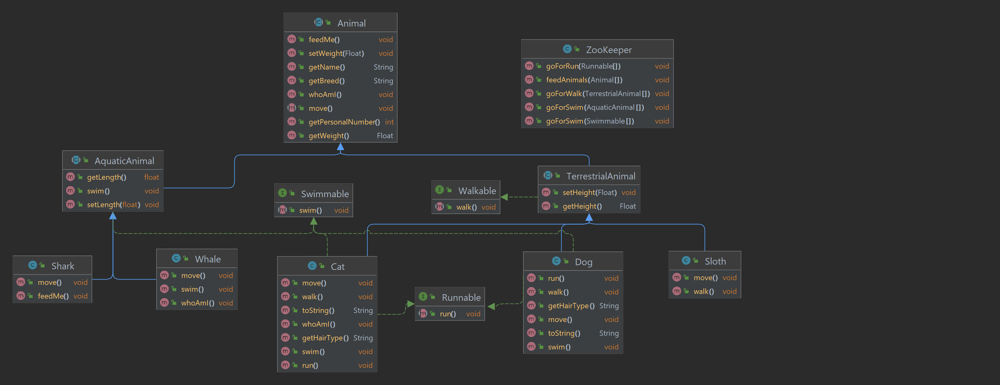

# Zoo

## Overview

This repository contains project where use java core concepts, such inheritance,polymorphism,abstraction and interface.

## Technologies Used

- **Framework:** Spring Boot 3
- **Language:** Java 21
- **Build Tool:** Maven

## UML diagram

